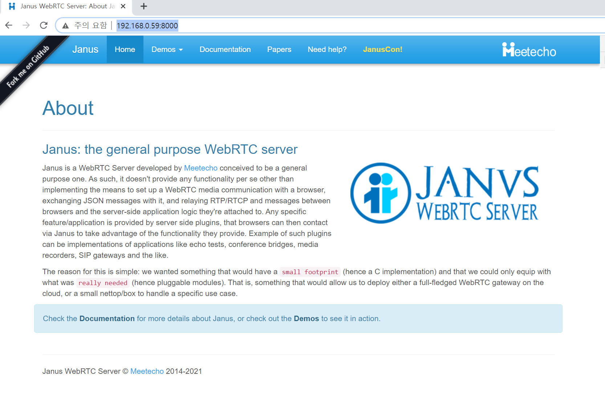

`janus` 는 `WebRTC` 서버입니다. WebRTC란 `Web Browser`에서 음성통화, 영상통화, 회의통화, 스트리밍 등 다양한 실시간 통신 서비스를 제공하는 오픈소스 프로젝트 입니다. `janus`는 `Browser` 간에 시그널링 기능을 제공하고 SFU, MCU 등과 같은 미디어 서버로써 1:1통화, 회의통화, 스트리밍 같은 서비스를 플러그인을 직접 개발하여 제공해줄 수 있습니다.   
janus는 웹서버가 아님에도 `demo`로 활용할수 있는 `web page` 를 제공해주는점이 참으로 편리한것 같습니다 ( 프론트 너무 어렵습니다 )

## install
linux 시스템에서 build하여 설치하는 방법과 docker방식 두가지를 작성해 보겠습니다.


### build

설치방법은 [janus-github](https://github.com/meetecho/janus-gateway) 사이트에도 잘 나와있지만 직접 입력한 커맨드를 정리해보겠습니다.

### package apt install 
```
sudo apt install libmicrohttpd-dev
sudo apt install libjansson-dev
sudo apt install libssl-dev
sudo apt install libsofia-sip-ua-dev
sudo apt install libopus-dev
sudo apt install libogg-dev
sudo apt install libcurl14-openssl-dev
sudo apt install libcurl4-openssl-dev
sudo apt install libwebsockets-dev
sudo apt install liblua5.3-dev
sudo apt install libconfig-dev
sudo apt install pkg-config
sudo apt install gengetopt
sudo apt install libtool
sudo apt install meson
sudo apt install libgstreamer-plugins-bad1.0-de
sudo apt install libgstreamer1.0-dev
sudo apt install libgstreamer-plugins-good1.0-dev
sudo apt install libgstreamer-plugins-base1.0-dev
sudo apt install libgstreamer-plugins-bad1.0-dev
```

#### libnice install
```
sudo apt install meson
git clone https://github.com/libnice/libnice.git
cd libnice
meson build
cd build
ninja -j 4
sudo ninjs install
```

#### libsrtp2-v2.2.0 install
libsrtp2 버전이 맞지않으면 DTLS 실패가 발생하는듯 합니다. 2.2.0 버전을 설치해줍니다.
```
wget https://github.com/cisco/libsrtp/archive/v2.2.0.tar.gz
tar xfv v2.2.0.tar.gz
cd libsrtp-2.2.0
./configure --prefix=/usr --enable-openssl
make shared_library && sudo make install
```

#### usrsctp install (for data channels)
janus의 Data Channel을 사용하지 않을거라면 빌드하지 않아도 됩니다.
```
git clone https://github.com/sctplab/usrsctp.git
cd usrsctp
mkdir build
cd build
cmake ..
make -j 4
sudo make install
```

### janus-gateway install
```
git clone https://github.com/meetecho/janus-gateway.git
cd janus-gateway/
./autogen.sh
./configure \
  --prefix=/opt/janus \
  --enable-data-channels \
  --disable-rabbitmq \
  --disable-mqtt \
  --disable-unix-sockets \
  --enable-plugin-echotest \
  --enable-plugin-recordplay \
  --enable-plugin-sip \
  --enable-plugin-videocall \
  --enable-plugin-voicemail \
  --enable-plugin-textroom \
  --enable-rest \
  --enable-turn-rest-api \
  --enable-plugin-audiobridge \
  --enable-plugin-nosip \
  --enable-all-handlers
make -j 4
sudo make install
sudo make configs
ldconfig
```

### check installed path
```
$ ls /opt/janus/
bin  etc  include  lib  share
```


## start janus

janus를 실행해 보겠습니다.
```
cd /opt/janus
./bin/janus
```
실행이 되지 않습니다. 로그를 보니 환경 파일이 없는것 같습니다.
```
cd /opt/janus/etc/janus
cp janus.jcfg.sample janus.jcfg
cp janus.transport.http.jcfg.sample janus.transport.http.jcfg
```
다시 실행합니다.
```
cd /opt/janus
./bin/janus
```

터미널을 새로 열어 http 서버를 실행합니다.
python 에서 제공하는 심플한 http server입니다. 개발용으로 사용하도록 하겠습니다.
```
cd /opt/janus/share/janus/demos
python3 -m http.server
```
python 2 버전인경우 `python -m SimpleHTTPServer` 입니다. 

브라우저에서 8000포트로 접속합니다.




## docker


TODO