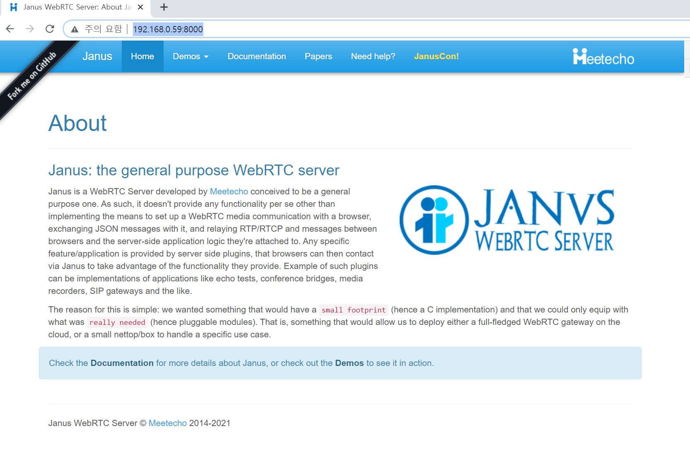

`janus` 는 `WebRTC` 서버입니다. WebRTC란 `Web Browser`에서 음성통화, 영상통화, 회의통화, 스트리밍 등 다양한 실시간 통신 서비스를 제공하는 오픈소스 프로젝트 입니다. `janus`는 `Brower` 간에 시그널링 기능을 제공하고 SFU, MCU 등과 같은 미디어 서버로써 1:1통화, 회의통화, 스트리밍 같은 서비스를 플러그인을 직접 개발하여 제공해줄 수 있습니다.

## install
linux 시스템에서 build하여 설치하는 방법과 docker방식 두가지를 작성해 보겠습니다.


### build

설치방법은 janus-github 사이트에도 잘 나와있지만 직접 입력한 커맨드를 정리해보겠습니다.

### package apt install 
```
sudo apt install libmicrohttpd-dev
sudo apt install libjansson-dev
sudo apt install libssl-dev
sudo apt install libsrtp-dev
sudo apt install libsofia-sip-ua-dev
sudo apt install libsrtp2-dev
sudo apt install libopus-dev
sudo apt install libogg-dev
sudo apt install libcurl14-openssl-dev
sudo apt install libcurl4-openssl-dev
sudo apt install libwebsockets-dev
sudo apt install liblua5.3-dev
sudo apt install libconfig-dev
sudo apt install pkg-config
sudo apt install gengetopt
sudo apt install libtool
sudo apt install meson
sudo apt install libgstreamer-plugins-bad1.0-de
sudo apt install libgstreamer1.0-dev
sudo apt install libgstreamer-plugins-good1.0-dev
sudo apt install libgstreamer-plugins-base1.0-dev
sudo apt install libgstreamer-plugins-bad1.0-dev
```

#### libnice install
```
sudo apt install meson
git clone https://github.com/libnice/libnice.git
cd libnice
meson build
cd build
ninja -j 4
sudo ninjs install
```

### cmake install
cmake 를 설치한 이유는 libwebsocket을 빌드하기 위해서입니다. 
```
wget https://github.com/Kitware/CMake/releases/download/v3.20.1/cmake-3.20.1.tar.gz
tar -zxvf cmake-3.20.1.tar.gz
cd cmake-3.20.1
./bootstrap
make -j 4
sudo make install
```

## libwebsockets install
```
git clone https://libwebsockets.org/repo/libwebsockets
cd libwebsockets
git checkout v3.2-stable
mkdir build
cd build
cmake -DLWS_MAX_SMP=1 -DLWS_WITHOUT_EXTENSIONS=0 -DCMAKE_INSTALL_PREFIX:PATH=/usr -DCMAKE_C_FLAGS="-fpic" ..
make -j 4
sudo make install
```

### janus-gateway install
```
git clone https://github.com/meetecho/janus-gateway.git
cd janus-gateway/
./autogen.sh
./configure --prefix=/opt/janus
make -j 4
sudo make install
```

### check installed path

```
$ /opt/janus$ ls /opt/janus/
bin  etc  include  lib  share
```


## start janus

janus를 실행해 보겠습니다.
```
cd /opt/janus
./bin/janus
```
실행이 되지 않습니다. 로그를 보니 환경 파일이 없는것 같습니다.
```
cd /opt/janus/etc/janus
cp janus.jcfg.sample janus.jcfg
cp janus.transport.http.jcfg.sample janus.transport.http.jcfg
```
다시 실행합니다.
```
cd /opt/janus
./bin/janus
```

http 서버를 실행합니다.
```
cd /opt/janus/share/janus/demos
python3 -m http.server
```
python 2 버전인경우 `python -m SimpleHTTPServer` 입니다. 

브라우저에서 8000포트로 접속합니다.




## docker


